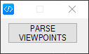
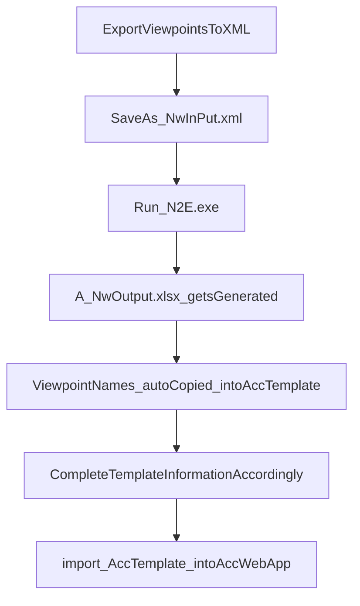

# N2eParser
*Migrate Navisworks Viewpoints Into an ACC Issues Template*

### This project is a Work-In-Process, and improved functionality will be added.

How to use:
1. Export your Navisworks viewpoints to an an XML file.
2. The exported XML file must be saved in the N2eParser folder as **NwInput.xml**
3. To run the N2eParser you can either
   1. Double-click the **N2E.exe**. A blue "</>" icon will appear in your Windows icon notification area on your taskbar and GUI button will appear. Then run each parsing instance by clicking on the **PARSE VIEWPOINTS** button
      1. 
4. After running the N2eParser, a **NwOutput.xlsx** file will be generated and the **acc-issues-import-template.xlsx** be updated with the latest Title for each Issue.
5. Complete the remaining information in the **acc-issues-import-template.xlsx** accordingly.
   1. Note that your information in the **acc-issues-import-template.xlsx** must match the existing parameters in you ACC project.

