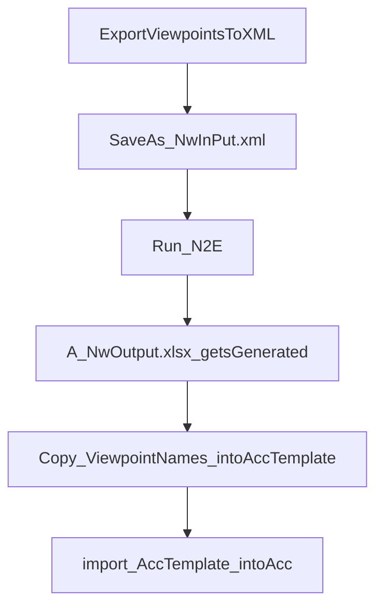

# N2eParser
Migrate Navisworks Viewpoints Into an ACC Issues Template

This project is a Work-In-Process, and improved functionality will be added.

How to use:
1. Export your Navisworks viewpoints to an an XML file.
2. The exported XML file must be saved in the N2eParser folder as "NwInput.xml"
3. To run the N2eParser you can either
   1. Double-click the N2E.exe. A blue "</>" icon will appear in your Windows icon notification area on your taskbar. Then run each parsing instance by typing "N2E" and pressing Space or Enter.  This is the easiest method for repeated use.
   2. or, run a single one-time instance by double clicking the N2E.py
4. After running the N2eParser, a "NwOutput.xlsx" file will be generated 

